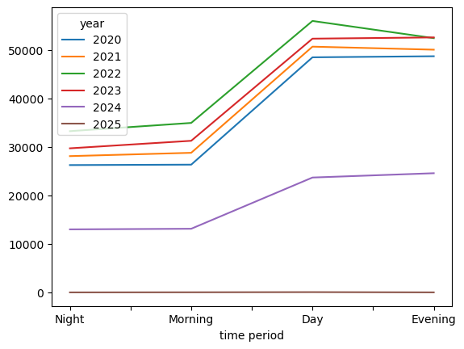
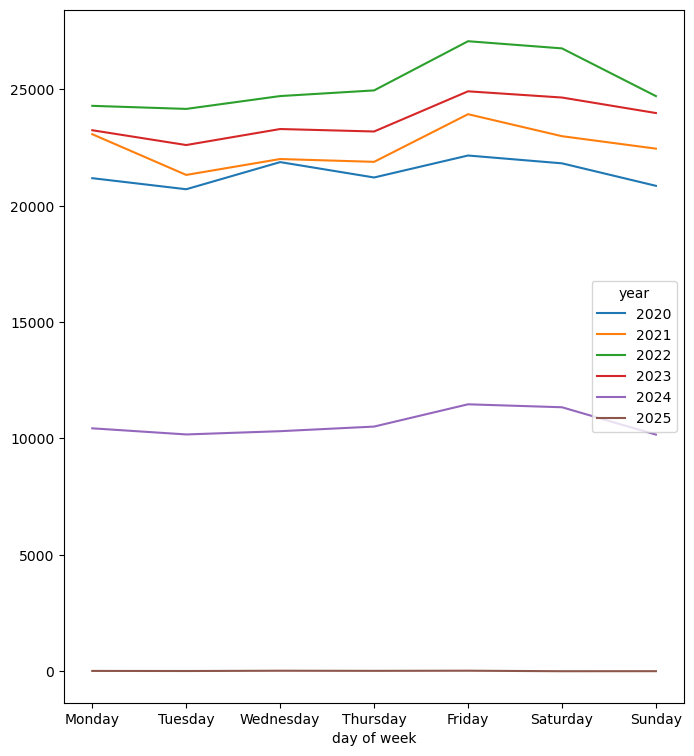
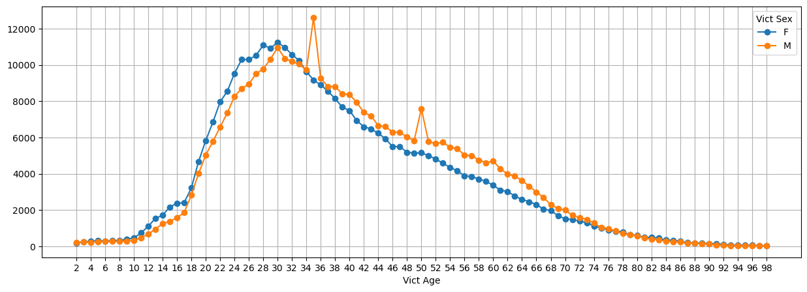
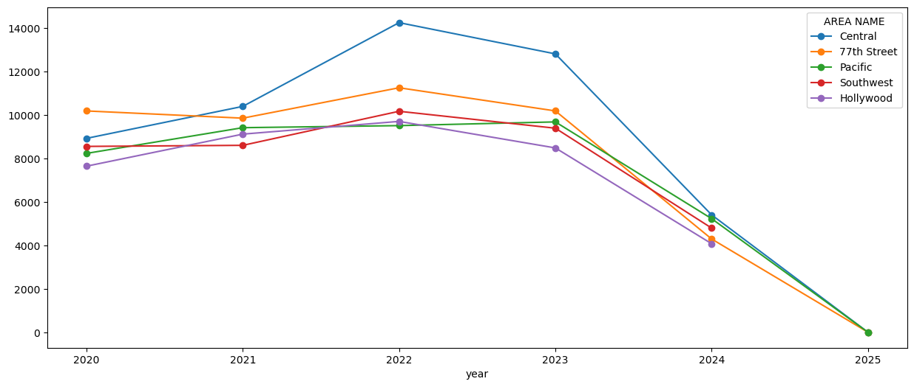

# Анализ преступности в Лос-Анджелесе 

**Задача:** Исследовать 700k+ записей о преступлениях в Лос-Анджелесе и выявить ключевые паттерны

**Основные результаты:**
- Пик преступности: день-вечер (когда люди наиболее активны - работа/учеба), ночью снижение преступной активности; пятница–суббота
- Типичная жертва: мужчина 30–35 лет
- Самый криминальный район: Central

- ## Графики

### 1. Преступления по часам суток

### 2. Преступления по дням недели

### 3. Возраст жертв

### 4. Топ-5 районов

